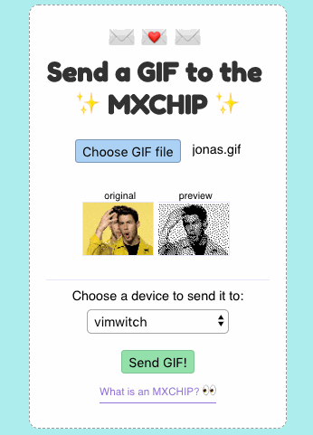
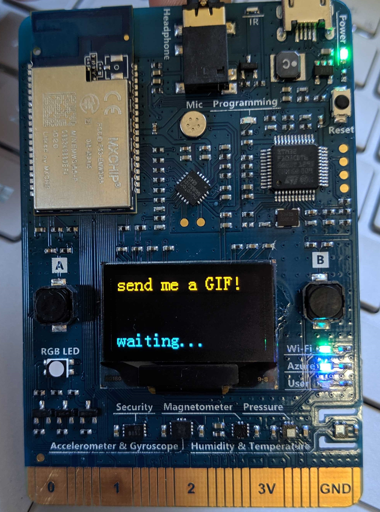
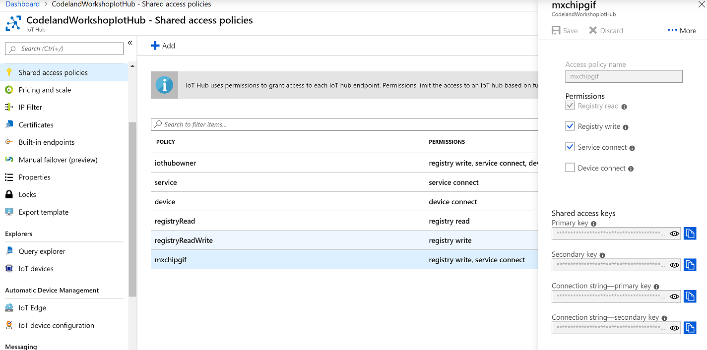

# Mxchip-gifs

A website to upload GIFs to the MXCHIP with Azure IoT Hub



## How do I run this example application?

Great question - let's get started. Most importantly though, you'll need to install a few things:
 - [NodeJS](https://nodejs.org) (version 8 or higher is fine).
 - [Arduino IDE](https://www.arduino.cc/en/main/software) (For Windows users: For easy configuration, download the Installer instead of installing the app from the store).
 - [Screen](https://linuxize.com/post/how-to-use-linux-screen/) OR [Putty](https://www.chiark.greenend.org.uk/~sgtatham/putty/latest.html)
 - [ST-Link/V2](http://www.st.com/en/development-tools/stsw-link009.html) (to configure Windows USB drivers)
- [VS Code](https://code.visualstudio.com/?WT.mc_id=mxchipgifs-github-cxa) and extensions:
  - [Arduino](https://marketplace.visualstudio.com/items?itemName=vsciot-vscode.vscode-arduino&WT.mc_id=mxchipgifs-github-cxa)
  - [Azure IoT Device Workbench](https://marketplace.visualstudio.com/items?itemName=vsciot-vscode.vscode-iot-workbench&WT.mc_id=mxchipgifs-github-cxa)
- You'll also need an [Azure account](https://azure.microsoft.com/en-us/free/?WT.mc_id=mxchipgifs-github-cxa), if you don't have one already.

 - **Optionally,** [Zadig](https://zadig.akeo.ie/) if you're having difficulties uploading code to your device on Windows.

1. Create an IoT Hub
2. Create a new device identity
3. Set credentials on your MXCHIP
4. Upload code to your MXCHIP
5. Add IoT Hub connection string to your environment variables
6. Start the server!

### 1. Create an IoT Hub

We're going to use IoT Hub to communicate from our website to our MXCHIP device. Follow the docs guide on [how to create an IoT Hub](https://docs.microsoft.com/en-us/azure/iot-hub/quickstart-send-telemetry-node#create-an-iot-hub?WT.mc_id=mxchipgifs-github-cxa). If you already have an IoT Hub to use, you can skip this step.

### 2. Create a new device identity

1. Once your IoT Hub is created, follow the docs guide on [how to create a new device identity in the Azure Cloud Shell](https://docs.microsoft.com/en-us/azure/iot-hub/quickstart-send-telemetry-node#register-a-device?WT.mc_id=mxchipgifs-github-cxa) or [in the portal](https://docs.microsoft.com/en-us/azure/iot-hub/iot-hub-raspberry-pi-web-simulator-get-started#register-a-new-device-in-the-iot-hub?WT.mc_id=mxchipgifs-github-cxa).
2. Once your device identity is created, copy the connection string. Refer to the docs guide to locate it.
3. Just follow those steps only and come back here. If you already have an IoT Hub to use, just create the device identity, and come back here when you're done.

### 3. Set credentials on your MXCHIP

We'll need to store some credentials on your MXCHIP device so that it can connect to both IoT Hub and to your chosen WIFI.

1. Plug in your MXCHIP via USB to your computer.
2. Open your favourite terminal with [screen](https://linuxize.com/post/how-to-use-linux-screen/) installed, or you can use [PuTTY](https://www.putty.org/).
3. Connect to your device via screen / PuTTY following the [MXCHIP documentation](https://microsoft.github.io/azure-iot-developer-kit/docs/use-configuration-mode/?WT.mc_id=mxchipgifs-github-cxa)
4. Once in the configuration terminal, use the `set_wifissid`, `set_wifipwd` commands to store your local Wifi settings on the device. Here's an example of a command: `set_wifissid My_SSID`
5. Use the `set_az_iothub` command with your device connection string you copied when you registered the device identity in an earlier step to store the device connection string on the device.
6. Use the `exit` command and watch the terminal to confirm that your MXCHIP is connected successfully.
7. You're done! Next step.

#### Device troubleshooting
- If you're having difficulty configuring your device in the terminal:
  - **Connecting your device to wifi:** Follow the configure wifi step in the following doc: [Get Started](https://microsoft.github.io/azure-iot-developer-kit/docs/get-started/?WT.mc_id=mxchipgifs-github-cxa)
  - **Setting the connection string**: In VS Code, hit Ctrl (or Cmd on OSX) + P to bring up the Command Palette, then type **Azure IoT Device Workbench: Configure Device Settings > IoT Hub Connection String** and paste your device connection string in the box.

### 3. Upload code to your MXCHIP

1. [Install Visual Studio Code](https://code.visualstudio.com/docs/setup/setup-overview) if you have not already.
2. [Setup your development environment for the MXCHIP following the guide](https://microsoft.github.io/azure-iot-developer-kit/docs/get-started/#prepare-the-development-environment?WT.mc_id=mxchipgifs-github-cxa).
    > You could use the commands from Azure IoT Device Workbench to provision IoTHub as well as set your device connection string. Check the above guide for details.
3. Open *project.code-workspace* file from the repository's root directory in Visual Studio Code.
4. Hit Ctrl (or Cmd on OSX) + P to bring up the Command Palette, then type **Arduino: Library Manager**, search for **ArduinoJson** and install version 5.13.5. Please do not install beta versions which contain breaking changes.
5. Hit Ctrl (or Cmd on OSX) + P again, and then type **Azure IoT Device Workbench**. Select the command of **Azure IoT Device Workbench: Update Device Code** to upload the device code to your MXCHIP. Ensure your MXCHIP is plugged in ^___^
6. The code should now be running on your device and waiting for a GIF! Onwards.




### 4. Add IoT Hub connection string to your environment variables

Our website needs to be able to see which devices are registered in your IoT Hub, and also to invoke device methods to control devices remotely. For this, we'll need a connection string for IoT Hub which has the right access policies.

1. [Create a new IoT Hub Access Policy](https://docs.microsoft.com/en-us/azure/iot-hub/iot-hub-devguide-security#access-control-and-permissions?WT.mc_id=mxchipgifs-github-cxa) with Service Connect, Registry Read, and Registry Write permissions. Name it 'mxchipgif' so that you remember what you created it for. This can be done the portal.



2. Copy the connection string for that policy.
3. Create a .env file under the repository's *server* folder in Visual Studio Code. Add the connection string value you copied in the previous step with the following format.

    ```dosini
    CONNECTION_STRING=your_connection_string
    ```

4. We're ready to run the server!

### 5. Start the server

1. Within this repository's folder on your computer, use your favourite terminal to run `cd server && npm install` 
2. Then, run `npm start` and navigate to localhost:3000 in your favourite browser
3. Try sending a GIF to your MXCHIP! ^___^

## Contributing

Contributions are welcomed! Please open a pull request or issue and detail as much as you can your ideas for improvement.

Check out the CONTRIBUTING.md file in this repository for details.

Most contributions require you to agree to a Contributor License Agreement (CLA) declaring that you have the right to, and actually do, grant us the rights to use your contribution. For details, visit https://cla.opensource.microsoft.com.

When you submit a pull request, a CLA bot will automatically determine whether you need to provide a CLA and decorate the PR appropriately (e.g., status check, comment). Simply follow the instructions provided by the bot. You will only need to do this once across all repos using our CLA.

This project has adopted the [Microsoft Open Source Code of Conduct](https://opensource.microsoft.com/codeofconduct/).
For more information see the [Code of Conduct FAQ](https://opensource.microsoft.com/codeofconduct/faq/) or
contact [opencode@microsoft.com](mailto:opencode@microsoft.com) with any additional questions or comments.

